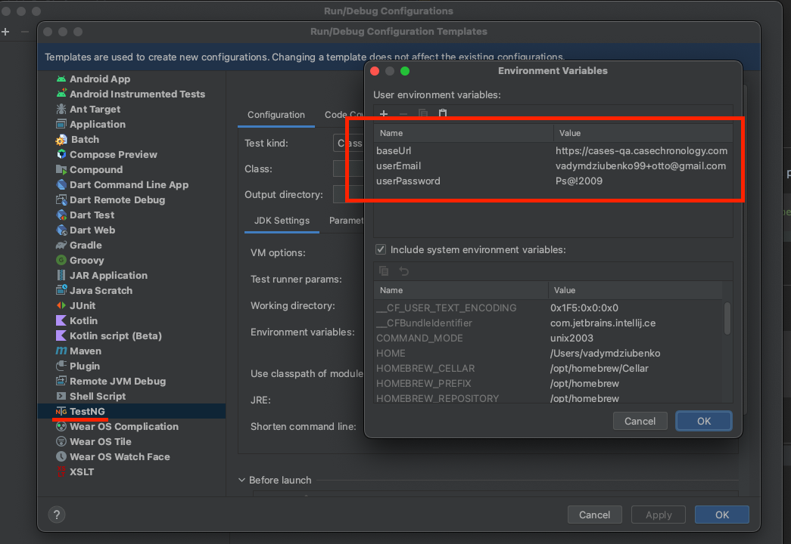
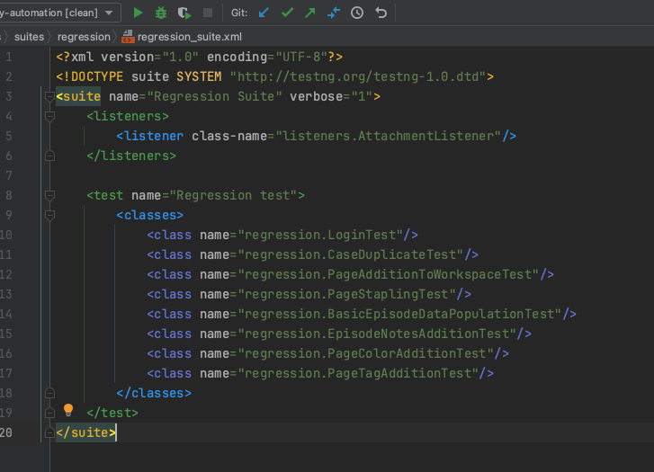
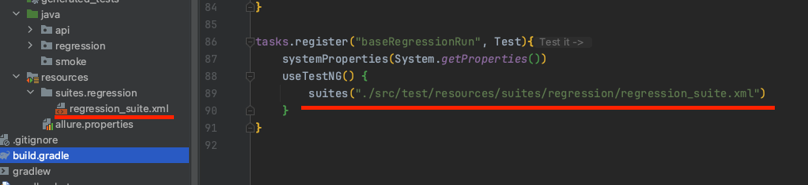

# Case Chronology Tests

### Links: [Case Portal](https://cases-qa.casechronology.com/)

___

### Software stack

- [Java 17 LTS](https://www.oracle.com/java/technologies/javase/17-0-5-relnotes.html)
- [Gradle](https://gradle.org/)
- [Rest Assured](https://rest-assured.io/)
- [TestNG](https://testng.org/doc/)
- AssertJ/ Soft Assertions
- [Allure Report](https://docs.qameta.io/allure/)
- [Selenide](https://ru.selenide.org/index.html)

___
Execution of UI/ API tests by running appropriate Gradle task with params:

```shell
./gradlew clean baseRegressionRun -DbaseUrl='baseUrl' -DuserName='userName' -DuserPassword='userPassword' -d
```
___
List of environment properties to be set before test run:

 ```
  baseUrl
  userName
  userPassword
 ```


___

### Allure Report generation

UI autotests:

```shell
allure serve ./build/allure-results
```

Using Gradle task:

```shell
allureServe
```
___

TestNG xml file example:


Gradle task that executes xml file with path to it:


